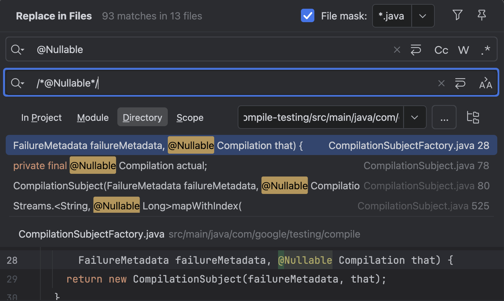
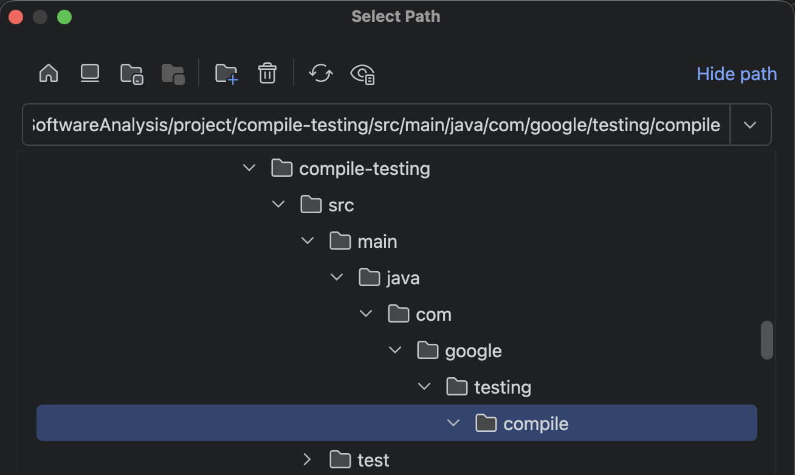
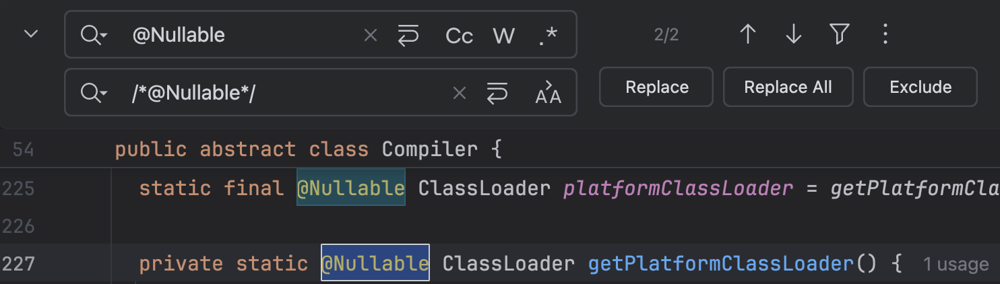
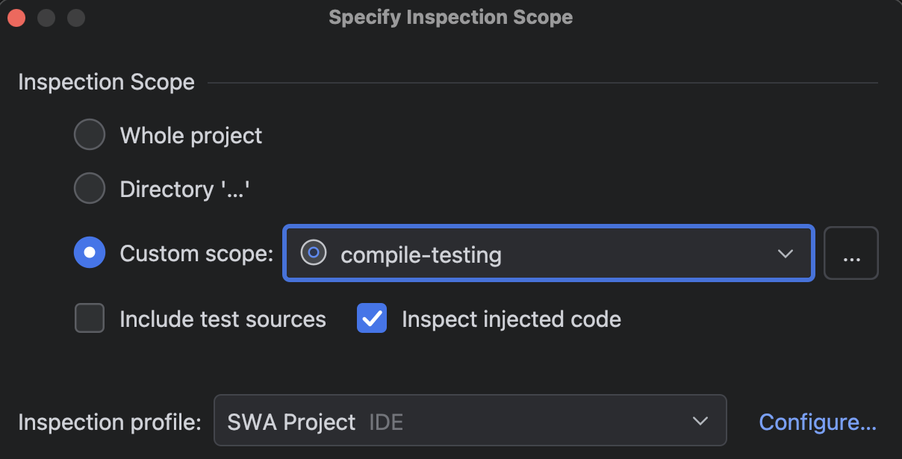
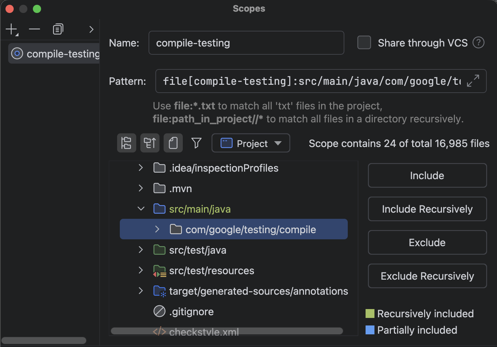
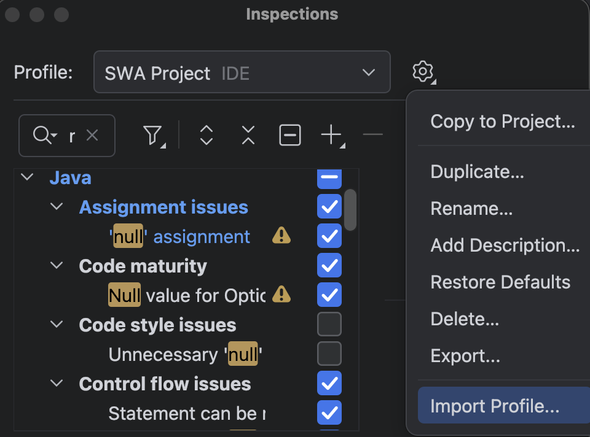
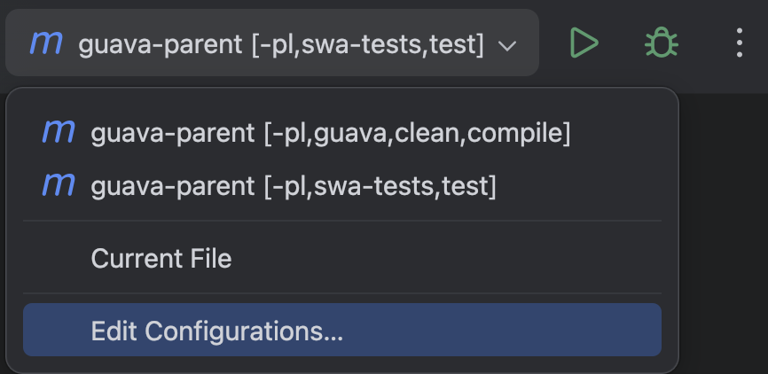
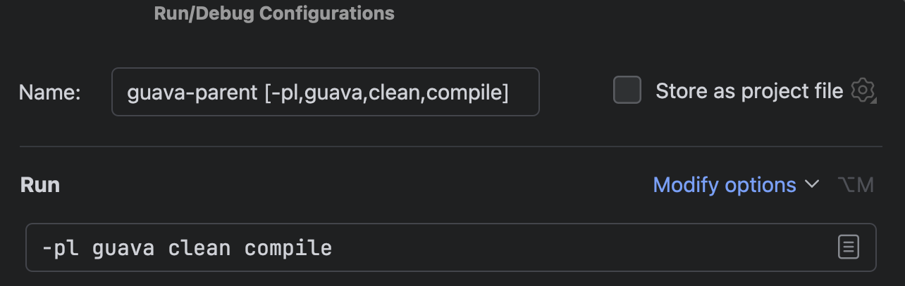
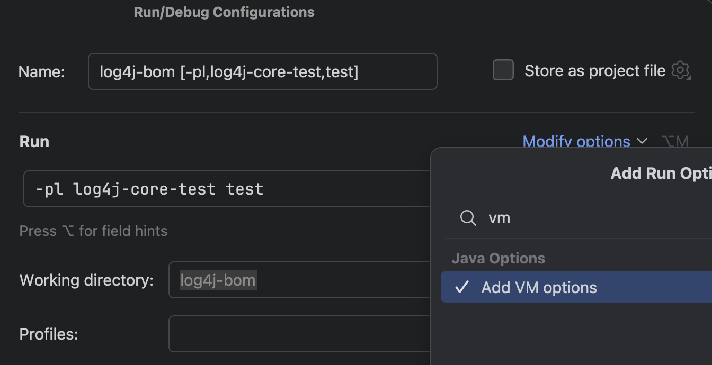
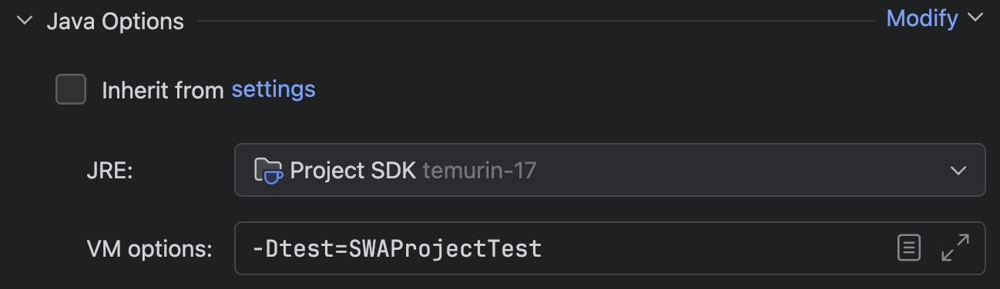

# Software Analysis Project Experimental Setup

Note: Tool and library versions are latest as of 3 Apr 2026.

## Development Environment

### Tools and Libraries

- [JDK](https://adoptium.net/temurin/releases/): 21 (preferred) or 17 (minimum)
- [IntelliJ IDEA](https://www.jetbrains.com/idea/download/): 2026.1
- JSpecify: 1.0.0
- NullAway: 0.13.1
- Error Prone: 2.48.0 (JDK 21) or 2.42.0 (JDK 17)

### Pulling Source Code

1. Clone the repository using `git clone`.
2. Checkout the provided release tag using `git checkout`.
3. Tip: Lines of code can be counted with `wc -l *.java` (non-recursive) or `find <dir> -name "*.java" | xargs wc -l`
   (recursive).

## Removing Annotations

1. Activate find and replace in IntelliJ across multiple files (note that IntelliJ only shows 100 occurrences maximum)
    1. Press **Cmd**/**Ctrl** + **Shift** + **R**
    2. Double press **shift** and search for **Replace in Files**
    3. Go to menu bar item **Edit** > **Find** > **Replace in Files**.

   
2. Select the **Directory tab** and **...** button and include only the desired source directories.

   
3. Alternatively, perform find and replace for individual files:
    1. Press **Cmd**/**Ctrl** + **R**
    2. Double press **Shift** and search for **Replace**
    3. Click the menu bar item **Edit** > **Find** > **Replace**.

   
4. Replace the following annotations:
    1. `@Nullable` with `/*@Nullable*/`
    2. `@NonNull` with `/*@NonNull*/` (may not exist)
    3. `@NullMarked` with `/*@NullMarked*/`
    4. `@NullUnarked` with `/*@NullUnmarked*/` (may not exist)
    5. Do not replace annotations inside block comments (/\*\*/).

### Tips

- Annotations can be counted with `grep -oi <pattern> *.java | wc -l`
  (special regex characters like \* should be escaped).
- Use version control to quickly switch between annotated and unannotated versions.

## IDE Code Inspection

1. Code inspection in IntelliJ can be initiated in the following ways:
    1. Click the menu bar items: **Code** > **Inspect Code...**
    2. Press **Shift** twice to open the search menu and type **Inspect Code...**
    3. **Right click** while editing a source file and go to **Analyze** > **Inspect Code**.

   
2. After opening the code inspection menu, create a custom scope (**...** button) to include only the source files of
   the desired packages.

   
3. Import this code [inspection profile](../config/SWA_Project.xml) under **Configure...** > **Gear icon**.

   

## Build System Configuration

1. Modify the pom.xml or build.gradle(.kts) file to enable NullAway checks for JSpecify annotations.
    1. If there are multiple such files, only the root build configurations should be modified.
2. Create a new Maven/Gradle configuration (see next sections) under the config dropdown > **Edit Configurations...** (
   recommended)
    1. You may run the commands directly in the terminal, but IntelliJ will take care of the working directory and JDK
       version.
3. If the Maven wrapper checksum is invalid, then remove the `distributionShaXSum=` and `wrapperShaXSum=` lines inside
   .mvn/wrapper/maven-wrapper.properties or acquire the correct checksum from the repository.

### Maven

- Compile Command: `./mvnw <—pl subproject> <—am> clean compile`
    - (You may need ``--am`` to build submodule dependencies first)
- Test Command: `./mvnw <—pl subproject> test`
- See this partial [pom.xml](../config/maven.xml) example and [.mvn/jvm.config](../config/maven.config) file.

### Gradle (Unused)

- Compile Command: `./gradlew clean <subproject>:compileJava`
- Test Command: `./gradlew <subproject>:test`
- See this partial [build.gradle.kts](../config/gradle.kts) example.

## Running Tests

Tip: To avoid running the existing tests and run only the added tests, create a run configuration and set 
**Modify options** > **Add VM options** > `-Dtest=<test_class>`. You may need to compile the main source files
before running tests.

